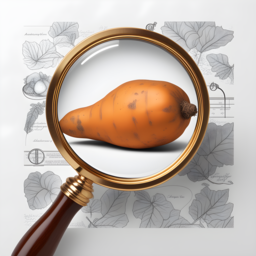

# AIpomoea 

## Tecnologia em Fenotipagem e Classificação

Este projeto é uma iniciação tecnológica (PIBITI-CNPQ) que representa uma parceria inovadora entre o Núcleo de Estudos e Pesquisas em Experimentação e Melhoramento Vegetal (NEPEM-UFSC) e o Núcleo de Estudos em Olericultura de Santa Catarina (NEOSC-UFSC). O objetivo principal é estabelecer um protocolo avançado de fenotipagem de alto rendimento para a batata-doce (Ipomoea batatas L.).

## Visão geral do projeto

Objetivos

    - Desenvolver um protocolo de fenotipagem de alto rendimento.
    - Classificar acessos genéticos de batata-doce com alta precisão.
    - Promover avanços na agricultura de batata-doce em termos de eficiência e qualidade nutricional.

Importância

A batata-doce é um alimento essencial em muitas culturas devido ao seu valor nutricional e adaptabilidade a diferentes condições climáticas. Melhorar a eficiência e precisão na fenotipagem pode resultar em cultivares mais resistentes e nutritivas, beneficiando produtores e consumidores.

## Tecnologia Empregada
O projeto emprega uma variedade de tecnologias avançadas:

### Visão computacional
Utilizamos técnicas de visão computacional para capturar e analisar imagens das plantas, permitindo a extração de características biométricas com alta precisão.

### Aprendizado de Máquina
Aplicamos algoritmos de aprendizado de máquina para analisar os dados coletados, melhorando a precisão na classificação e identificação de características importantes das plantas.

### Métodos analíticos sofisticados
Empregamos outros métodos estatísticos e analíticos avançados para reduzir a subjetividade e aumentar a eficiência na análise dos dados fenotípicos.

## Objetivos e resultados esperados
    - Otimização na classificação dos acessos genéticos de batata-doce.
    - Melhoria na qualidade e eficiência dos processos de melhoramento vegetal.
    - Desenvolvimento de cultivares mais resistentes a doenças e com melhores características biométricas.

## Desenvolvedores

Este projeto foi desenvolvido por: Matheus L. Machado sob orientação do Prof Dr. Tiago Olivoto

## Informações de uso

Um guia prático do projeto está disponível em forma .pdf

## Contato

Para mais informações ou dúvidas, entre em contato com o desenvolvedor [Email](mailto:matheuslmachado03@gmail.com)

## Licença

Para mais detalhes, consulte o arquivo LICENSE no repositório.

Esperamos que este projeto contribua significativamente para o avanço da fenotipagem e classificação de batata-doce, promovendo uma agricultura mais eficiente e nutritiva.
